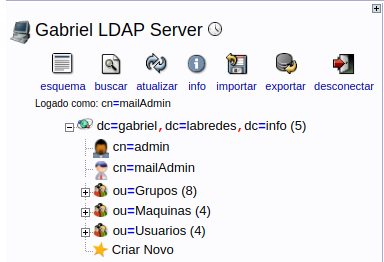

# Postfix + LDAP + Dovecot

## Introdução

Este relatório apresenta a integração dos serviços de envio e recebimento de e-mail, através dos protocolos SMTP e IMAP, utilizando os softwares Postfix e Dovecot integrados a uma base de dados LDAP. Iremos utilizar o Sistema Operacional CentOS 7, o mesmo pode ser obtido em [https://www.centos.org/download/](https://www.centos.org/download/)

## LDAP

### Estrutura Organizacional


A seguir temos o usuário `diego`, utilizado posteriormente nos testes e nos exemplos:

```text
dn: uid=diego,ou=Usuarios,dc=gabriel,dc=labredes,dc=info
uid: diego
cn: diego
sn: ferreira
homeDirectory: /home/diego
loginShell: /bin/bash
gecos: Diego Ferreira
userPassword:: e2NyeXB0fSQ2JGZQODBKM29iZEVZeFdJVFMkYzVlL1VrTUtMYmVqeDNJYWJlM01
 HMEo1eDc0L1hyNk1XdVdocmFLMWx4Ymp3b2xkazlQa0V4QnZXTHlIS2ZxMEV3Q05kVjBwR3FmNHQ0
 RnVlRHRwWTE=
shadowLastChange: 18177
shadowMax: 99999
shadowWarning: 7
uidNumber: 10003
gidNumber: 10003
objectClass: posixAccount
objectClass: shadowAccount
objectClass: inetOrgPerson
objectClass: postfixUser
mailacceptinggeneralid: diego@blockchain.com
maildrop: diego@fsociety.com
```

O diretório LDAP precisa manter várias informações necessárias relacionadas ao`Postfix`e ao`Dovecot`para o funcionamento dos serviços.

* Nome de usuário e senha para autenticação
* `UID`e `GID`para gerenciar permissões do usuário`maildir`
* Localização do `maildir`
* Lista de aliases de correio para um determinado usuário para permitir que um usuário tenha vários endereços de correio.

As informações da conta podem ser armazenadas com o `posixAccount`objectClass. Para armazenar os aliases, um novo schema`LDAP` precisa ser instalado. Ele apresentará um objectClass `postfixUser`com os dois atributos

* `mailacceptinggeneralid` para armazenar uma lista de aliases \(apelidos\) de email
* `maildrop` para definir um ou mais destinos finais para o correio enviado para os aliases fornecidos

Para instalar o schema`postfixUser,`faça o download no link a seguir e adicione-o à sua base LDAP.

[https://raw.githubusercontent.com/68b32/postfix-ldap-schema/master/postfix.ldif](https://raw.githubusercontent.com/68b32/postfix-ldap-schema/master/postfix.ldif)

```text
wget -O postfix.ldif https://raw.githubusercontent.com/68b32/postfix-ldap-schema/master/postfix.ldif
```

Como `postfix`e o`dovecot`consultarão o diretório, um usuário separado deve ser criado junto com permissões suficientes para ler a base`ou=Usuarios,dc=gabriel,dc=labredes,dc=info`

`No nosso caso, basta adicionar um usuário cn=mailAdmin na nossa base, como no exemplo abaixo:`



Verifique se as contas LDAP anônimas têm permissão para se autenticar com`userPassword,` pois esse mecanismo será usado no`dovecot`para autenticar os clientes.

```text
to attrs=userPassword
  by self =xw
  by anonymous auth
  by * none

to dn.subtree="ou=Usuarios,dc=gabriel,dc=labredes,dc=info"
  by dn.base="cn=mailAdmin,ou=Usuarios,dc=gabriel,dc=labredes,dc=info" read
  by * none
```

## Postfix

### LDAP mapping

Antes de configurar o postfix para entregar e receber emails, criaremos algumas [tabelas de pesquisa LDAP que o](http://www.postfix.org/ldap_table.5.html) postfix usará para realizar as consultas na base. A tabela a seguir fornece uma visão geral de como as informações são consultadas:


Crie um diretório `/etc/postfix/ldap`para manter todas as definições de mapa em um só lugar. Como os arquivos neste diretório conterão suas credenciais LDAP, defina seu proprietário como `postfix:postfix`e seu `umask` como `0100`.

As informações de conexão para o diretório LDAP são comuns a todos os arquivos de mapeamento, ou seja, o trecho a seguir pode ser copiado para a parte inicial de cada arquivo citado na tabela acima.

```text
# copie este trecho de autenticação para todos
os arquivos de mapas a serem criados

server_host = ldap://ldap1.labredes.info
start_tls = yes
version = 3
tls_require_cert = no

bind = yes
bind_dn = cn=mailAdmin,ou=Usuarios,dc=gabriel,dc=labredes,dc=info
bind_pw = <Password for bind_dn>

search_base = ou=Usuarios,dc=gabriel,dc=labredes,dc=info
scope = sub
```

[`virtual_alias_domains`](https://www.vennedey.net/code/490abca5cd9343d271a7fbbde1a6a48e37f3135055434e6fe0c16679edb534ed)

```text
# cole aqui o trecho de autenticação

query_filter = mailacceptinggeneralid=*@%s 
result_attribute = mailacceptinggeneralid 
result_format = %d
```

[`virtual_alias_maps`](https://www.vennedey.net/code/490abca5cd9343d271a7fbbde1a6a48e6f574cbe1300b5aa9ae4aaae5deddcaf)

```text
# cole aqui o trecho de autenticação

query_filter = mailacceptinggeneralid=%s
result_attribute = maildrop
```

[`virtual_mailbox_maps`](https://www.vennedey.net/code/490abca5cd9343d271a7fbbde1a6a48ebfdf6e05fd2f5c2659ac3798deea9ba5)

```text
# cole aqui o trecho de autenticação

query_filter = maildrop=%s
result_attribute = homeDirectory
result_format = %s/Maildir/
```

[`virtual_uid_maps`](https://www.vennedey.net/code/490abca5cd9343d271a7fbbde1a6a48ec9a4e0898457612d4c6a33683af5c4bc)

```text
# cole aqui o trecho de autenticação

query_filter = maildrop=%s
result_attribute = uidNumber
```

[`smtpd_sender_login_maps`](https://www.vennedey.net/code/490abca5cd9343d271a7fbbde1a6a48e9d8789a67b49d7c206067fe8a2462756)

```text
# cole aqui o trecho de autenticação

query_filter = (|(mailacceptinggeneralid=%s)(maildrop=%s))
result_attribute = uid
```

Você pode testar o mapeamento com o comando `postmap.`Aqui está um exemplo de saída para um usuário já cadastrado na base LDAP usada como exemplo. \(utilizaremos o usuário `diego`, definido anteriormente como exemplo de testes\)

```text
root@servidor:~# postmap -q blockchain.com ldap:/etc/postfix/ldap/virtual_alias_domains
blockchain.com, blockchain.com

root@servidor:~# postmap -q diego@fsociety.com ldap:/etc/postfix/ldap/virtual_mailbox_maps
/home/diego/Maildir

root@servidor:~# postmap -q diego@fsociety.com ldap:/etc/postfix/ldap/virtual_uid_maps
10003

root@servidor:~# postmap -q diego@blockchain.com ldap:/etc/postfix/ldap/smtpd_sender_login
diego
```

Como os arquivos contêm credenciais para autenticação ao LDAP, defina as permissões de arquivo adequadas.

```text
root@servidor:~# chown postfix:postfix /etc/postfix/ldap/*
root@servidor:~# chmod 400 /etc/postfix/ldap/*
```

### Caixas de Correio

O Postfix implementa métodos diferentes para entregar e-mails ao destinatário. Nesta configuração, usaremos a _classe de domínio de alias virtual_ e a _classe de domínio da caixa de correio virtual_ . Cada caixa de correio final é associada a um endereço definido `<username>@$myhostname.` O`$myhostname`contém o nome do host definido em `/etc/postfix/main.cf`e será listado no arquivo`virtual_mailbox_domains`. Todos os domínios hospedados são tratados como _domínios de alias virtual_ e serão listados `virtual_alias_domains`com o mapa LDAP definido anteriormente e mapeados para o endereço da caixa de correio final.

Vamos configurá-lo com os parâmetros necessários para autenticação com LDAP. Abra o arquivo localizado em`/etc/postfix/main.cf` e adicione as seguintes linhas:

```text
home_mailbox = Maildir/

virtual_alias_domains = ldap:/etc/postfix/ldap/virtual_alias_domains
virtual_mailbox_domains = $myhostname

virtual_alias_maps = ldap:/etc/postfix/ldap/virtual_alias_maps
virtual_mailbox_base = /
virtual_mailbox_maps = ldap:/etc/postfix/ldap/virtual_mailbox_maps
virtual_uid_maps = ldap:/etc/postfix/ldap/virtual_uid_maps
virtual_gid_maps = ldap:/etc/postfix/ldap/virtual_uid_maps
smtpd_sender_login_maps = ldap:/etc/postfix/ldap/smtpd_sender_login_maps
local_recipient_maps =

smtpd_client_restrictions = permit_mynetworks, permit_sasl_authenticated, reject_unauth_destination
smtpd_recipient_restrictions = permit_mynetworks, permit_sasl_authenticated, reject_unauth_destination
```

O diretório que `/home/<usuario>`contém as informações de e-mails dos usuários e deve ser criado com antecedência, ser gravável por todos os usuários de email em potencial. Para conseguir isso, use o mesmo `GID`em todos os usuários de email e defina a propriedade do grupo. para isso, use o mesmo`GID` para todos os usuários ou torne o diretório gravável para todos.

```text
root@servidor:~# mkdir -p /home/<usuario>
root@servidor:~# chmod o+w /home/<usuario>                                         # Make world writable or
root@servidor:~# chown :<common GID> /home/<usuario> && chmod g+w /home/<usuario>  # use common group
```

Reinicie o serviço do postfix e verifique se foi startado com êxito, em seguida verifique os logs do email.

```text
# systemctl stop postfix
# systemctl start postfix
# tail -f /var/log/maillog
```

## Dovecot

Enquanto o Postfix servirá como servidor e retransmissão `smtp,` o`Dovecot`servirá como servidor[`IMAP`](https://en.wikipedia.org/wiki/Internet_Message_Access_Protocol)para recuperar as mensagens armazenadas no host de correio. O Dovecot também inclui uma implementação [SASL](https://en.wikipedia.org/wiki/Simple_Authentication_and_Security_Layer) que pode ser usada pelo postfix para autenticar usuários.

### Configuração

A configuração do dovecot está espalhada por vários arquivos em `/etc/dovecot/`e `/etc/dovecot/conf.d`e contém alguns blocos básicos de configuração, que podem ser incluídos descomentando eles.

### Localização de Maildir <a id="maildir_location"></a>

A localização do Maildir está definida em `/etc/dovecot/conf.d/10-mail.conf`. O diretório doméstico do usuário que será lido no LDAP é `/Maildir` e será anexado com a seguinte configuração.

```text
maildir:~/Maildir
```

### Back-end LDAP <a id="ldap_backend"></a>

O Dovecot pode usar o LDAP como um banco de dados de senha para autenticação, bem como um banco de dados do usuário para obter informações como o local do maildir e o `UID`e `GID`do usuário.

Para ativar o LDAP como um banco de dados de senha e usuário, vá até o arquivo`etc/dovecot/conf.d/10-auth.conf`e desative-o `auth-system.conf.ext.`

```text
#!include auth-system.conf.ext
!include auth-ldap.conf.ext
```

Agora no arquivo `/etc/dovecot/conf.d/auth-ldap.conf.ext`deve conter a declaração para `passdb`e`userdb,` responsáveis pela autenticação no LDAP.

```text
passdb {
        driver = ldap
        args = /etc/dovecot/dovecot-ldap.conf.ext
}
userdb {
        driver = ldap
        args = /etc/dovecot/dovecot-ldap.conf.ext
}
```

O arquivo `/etc/dovecot/dovecot-ldap.conf.ext`é usado por ambos,`passdb`e `userdb`para configurar os parâmetros de conexão com o diretório LDAP.

```text
uris = ldap://ldap1.labredes.info
dn = cn=mailAdmin,dc=gabriel,dc=labredes,dc=info
dnpass = <sua senha secreta>
tls = no
debug_level = 0
auth_bind = yes
auth_bind_userdn = uid=%u,ou=Usuarios,dc=gabriel,dc=labredes,dc=info
ldap_version = 3
base = ou=Usuarios,dc=gabriel,dc=labredes,dc=info
scope = subtree
user_attrs = homeDirectory=home,uidNumber=uid,gidNumber=gid
user_filter = (&(objectClass=posixAccount)(uid=%u))
```

A configuração `auth_bind = yes`tenta se conectar ao OpenLDAP com o DN do usuário IMAP autenticado em vez de verificar a senha diretamente. A vantagem dessa configuração é que a senha armazenada no diretório não precisa ser legível pelo Dovecot. Quando o `auth_bind_userdn`modelo é definido, o`pass_attr`pode ser omitido. O`user_filter`define o filtro para encontrar a entrada LDAP usando o nome de usuário de login. O`user_attrs`mapeia os atributos LDAP para os atributos internos do Dovecot. Ao recuperar as informações do usuário, o Dovecot se conecta ao diretório com as credenciais definidas nas diretivas `dn`e `dnpass`.

Após realizar as configurações necessários nos arquivos do dovecot, reinicie o serviço e verifique os logs.

```text
# systemctl stop dovecot
# systemctl start dovecot
# tail -f /var/log/maillog
```

## Integração de usuários

Para que os usuários da base LDAP sejam reconhecidos no sistema Linux, os procedimentos a seguir devem ser seguidos rigorosamente. Não é necessário fazer alterações nos arquivos de configuração do PAM se os usuários do e-mail não forem fazer login no sistema.

Instale os pacotes do `ldap` responsáveis pela configuração da base, a fim de obter a integração dos usuários LDAP no sistema CentOS.

```text
# yum install openldap openldap-clients
```

Vá até o arquivo de configuração `/etc/openldap/ldap.conf` e adicione as configurações referentes à sua base.

```text
BASE    dc=gabriel,dc=labredes,dc=info
URI     ldap://ldap1.labredes.info
```

Agora vamos ao arquivo `/etc/nsswitch.conf`e modificar as linhas `passwd, shadow e group` adicionando o `compat ldap:`

```text
passwd:     compat ldap
shadow:     compat ldap
group:      compat ldap
```

No arquivo /etc/nslcd.conf adicione as informações da base LDAP:

```text
uri ldap://ldap1.labredes.info
base dc=gabriel,dc=labredes,dc=info
binddn cn=admin,dc=gabriel,dc=labredes,dc=info
bindpw <sua senha secreta>
```

Ao realizar todas as modificações, reinicie os serviços responsáveis pelas consultas a base ldap para armazenamento local.

O nslcd é um daemon que fará consultas LDAP para processos locais com base em um arquivo de configuração simples.

Nscd é um daemon que fornece um cache para as solicitações de serviço de nome mais comuns. O arquivo de configuração padrão, `/etc/nscd.conf` , determina o comportamento do daemon de cache.

```text
# systemctl stop nslcd
# systemctl start nslcd
# systemctl stop nscd
# systemctl start nscd
# systemctl enable nslcd
# systemctl enable nscd
```

Após reiniciar os serviços, execute o comando a seguir para obter os usuários da base LDAP.

```text
# getent passwd
```

A saída do comando deverá retornar todos os usuários cadastrados no `/etc/passwd` + os usuarios da sua base LDAP.

Exemplo:

```text
named:x:25:25:Named:/var/named:/sbin/nologin
dovecot:x:97:97:Dovecot IMAP server:/usr/libexec/dovecot:/sbin/nologin
dovenull:x:997:993:Dovecot's unauthorized user:/usr/libexec/dovecot:/sbin/nologin
zabbix:x:996:992:Zabbix Monitoring System:/var/lib/zabbix:/sbin/nologin
postgres:x:26:26:PostgreSQL Server:/var/lib/pgsql:/bin/bash
ldap:x:55:55:OpenLDAP server:/var/lib/ldap:/sbin/nologin
nscd:x:28:28:NSCD Daemon:/:/sbin/nologin
nslcd:x:65:55:LDAP Client User:/:/sbin/nologin
marlon:x:10001:10001:Marlon Silva:/home/marlon:/bin/bash
rafael:x:10002:10002:Rafael Alencar:/home/rafael:/bin/bash
diego:x:10003:10003:Diego Ferreira:/home/diego:/bin/bash
samuel:x:10004:10004:Samuel Martins:/home/samuel:/bin/bash
```

## DNS

Uma parte importante na configuração do servidor e na infra-estrutura inclui manter uma maneira fácil de procurar interfaces de rede e endereços IP por nome, através da criação de um Domain Name System \(DNS\). O uso de nomes de domínio totalmente qualificados \(FQDNs\), em vez de endereços IP para especificar endereços de rede, facilita a configuração de serviços e aplicações. Configurar o seu próprio DNS para a sua rede privada é uma ótima maneira de melhorar a gestão dos seus servidores.

Para utilizar o Thunderbird Mail na máquina física, será necessário adicionar o DNS do seu servidor onde está o Postfix, para o thunderbird ter acesso as configurações fornecidas pelo servidor de email, consequentemente ser capaz de enviar e receber e-mails

## Referências

* CAMARGO, H. A. Integração de Sistemas e Serviços com Samba e LDAP. Lavras: UFLA/FAEPE, 2011. \(Curso de Pós Graduação "Lato Sensu"\(Especialização\) a Distância em Administração em Redes Linux\).
* [https://www.vennedey.net/resources/2-LDAP-managed-mail-server-with-Postfix-and-Dovecot-for-multiple-domains\#ldap](https://www.vennedey.net/resources/2-LDAP-managed-mail-server-with-Postfix-and-Dovecot-for-multiple-domains#ldap)
* [http://www.postfix.org/documentation.html](http://www.postfix.org/documentation.html)
* [https://linux.die.net/man/8/nscd](https://linux.die.net/man/8/nscd)
* [https://linux.die.net/man/8/nslcd](https://linux.die.net/man/8/nslcd)

